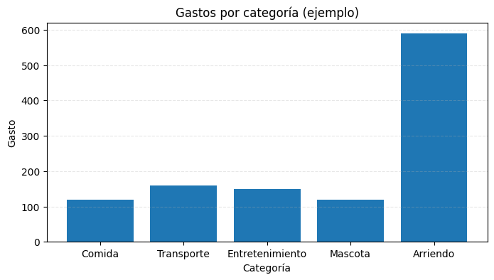

# Análisis de gastos personales (Python)

Este proyecto es un ejercicio introductorio de análisis de datos.  
Se utilizó Google Colab, Python, pandas y matplotlib para:

- Crear un conjunto de datos simple de gastos.
- Calcular métricas descriptivas (total, promedio, máximo, mínimo).
- Visualizar los resultados en un gráfico de barras.

## Tecnologías
- Python 3
- Pandas
- Matplotlib
- Google Colab

## Resultados
El análisis muestra que la categoría *Arriendo* representa la mayor parte de los gastos mensuales.

## 🛠️ Tecnologías utilizadas
- Python 3
- Pandas
- Matplotlib
- Google Colab

## 📂 Estructura del repositorio
- `analisis_gastos.ipynb` → Notebook con el código
- `grafico_gastos.png` → Gráfico de ejemplo
- `README.md` → Documentación del proyecto
